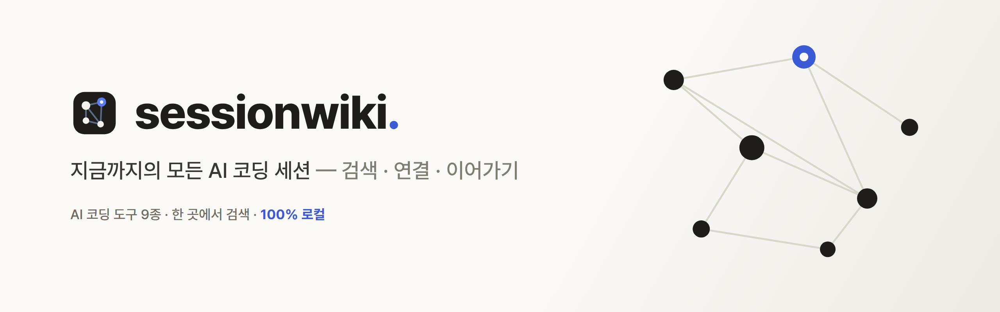
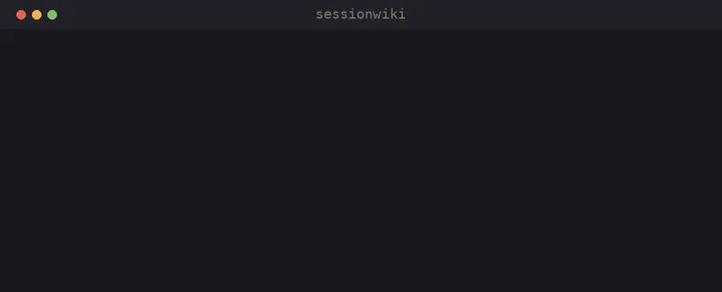
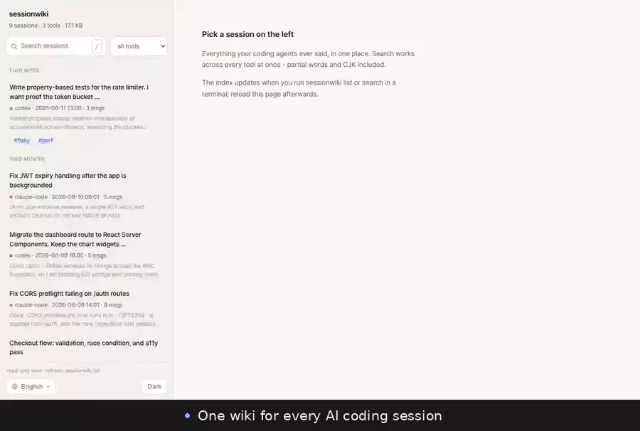
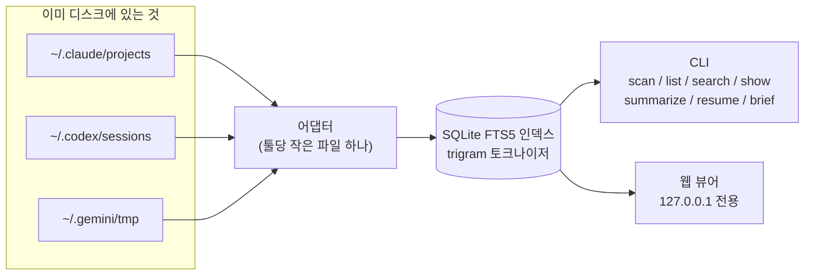

<div align="center">

<picture>
  <source media="(prefers-color-scheme: dark)" srcset="docs/banner-ko-dark.png">
  
</picture>

<a href="https://github.com/youdie006/sessionwiki/actions/workflows/ci.yml"></a>
<a href="LICENSE"></a>
<a href="https://github.com/youdie006/sessionwiki/releases"></a>

<a href="README.md#adding-an-adapter"></a>

<a href="README.md"></a>&nbsp;



</div>

3주 전에 Claude가 고쳐준 그 CORS 버그 대화, 아직 디스크에 있습니다 &mdash; 못 찾을 뿐이죠. 모든 AI 코딩 에이전트는 세션을 디스크에 기록합니다. 툴마다 다른 포맷으로, 다른 폴더에, 쓰는 머신마다 제각각. 몇 달이면 해결된 문제로 가득한 대화 수천 개가 쌓이는데, 다시 찾아갈 방법이 없습니다.

**sessionwiki는 툴들이 어차피 남기는 흔적을 읽어 하나의 검색 가능한 아카이브로 만듭니다.** 데몬도, 기록 습관도, 클라우드도 필요 없습니다. 이미 있는 것을 인덱싱할 뿐입니다.

```console
$ sessionwiki scan
TOOL            SESSIONS       SIZE  OLDEST       NEWEST        PATH
claude-code         1763     1.1 GB  2026-03-27   2026-06-12    ~/.claude/projects
codex               2340    45.9 GB  2025-08-21   2026-06-12    ~/.codex/sessions
gemini                50     1.2 MB  2026-04-02   2026-06-10    ~/.gemini/tmp

4153 sessions across 3 tools, 47.0 GB on disk.
```

실제 머신 한 대의 결과입니다. 본인 머신에서 돌려보세요 &mdash; 숫자에 보통 놀랍니다.

읽는 게 더 편하면 웹 UI도 있습니다 &mdash; `sessionwiki web`:



## 무엇을 할 수 있나

- **찾기** &mdash; 이 머신의 모든 세션 저장소: 어떤 툴이, 어디에, 몇 개, 몇 GB &mdash; 즉시.
- **검색** &mdash; 모든 툴의 모든 메시지를 한 번에. 부분 문자열 매칭이라 식별자 조각도, 한국어·일본어·중국어도 별도 설정 없이 검색됩니다.
- **읽기** &mdash; 코드 블록 렌더링, 접힌 툴 호출, 긴 세션의 목차까지 갖춘 깔끔한 트랜스크립트.
- **요약** &mdash; 본인 LLM CLI로 세션마다 한두 문장 시놉시스를 만들어 캐시 &mdash; "이 세션 뭐였지"가 사라집니다.
- **이어가기** &mdash; 명령 하나로 원래 툴에서, 원래 프로젝트 디렉토리에서 세션을 다시 엽니다.
- **컨텍스트 이식** &mdash; Claude Code 세션을 Codex로, 어디로든 브리핑해서 넘깁니다.

## 설치

**빌드된 바이너리** (툴체인 불필요). macOS / Linux:

```console
curl -sSL https://raw.githubusercontent.com/youdie006/sessionwiki/main/scripts/install.sh | sh
```

스크립트가 플랫폼에 맞는 아카이브를 [최신 릴리스](https://github.com/youdie006/sessionwiki/releases/latest)에서 받아 `~/.local/bin`에 설치합니다. Windows는 릴리스 페이지에서 `.zip`을 받으세요.

**Rust(stable)** 가 있다면:

```console
cargo install --git https://github.com/youdie006/sessionwiki
```

어느 쪽이든 런타임 의존성 없는 단일 바이너리입니다.

## 빠른 시작

```console
sessionwiki scan                # 내 세션이 어디에 있지?
sessionwiki search "jwt retry"  # 모든 툴을 가로지르는 전문 검색
sessionwiki show 3f9c           # 찾은 대화 읽기
sessionwiki web                 # 또는 로컬 웹 UI로 전부 둘러보기
```

첫 `search`/`list`가 인덱스를 만듭니다. 기록 1GB당 몇 분 정도 걸리는 일회성 비용이고(Codex 헤비유저는 수십 GB일 수 있습니다), 이후 갱신은 증분이라 몇 초면 끝납니다.

## 명령어

| 명령 | 설명 |
|---|---|
| `scan` | 이 머신의 세션 저장소를 발견. 파일시스템만 훑으므로 즉시 끝납니다. |
| `list` | 모든 툴의 최근 세션을 한 타임라인으로. `--tool codex`, `--project api`, `--tag spike`, `-n 50`, `--all`(서브에이전트 트랜스크립트 포함). |
| `search <검색어>` | 모든 툴의 모든 메시지를 전문 검색. 최소 3글자. |
| `show <id>` | 세션 하나를 읽기 좋은 트랜스크립트로. `--full`은 툴 호출 전체 표시, `--json`은 파싱 결과 출력, `--outline`은 다이제스트(내가 던진 질문 전부 + 어떻게 끝났는지). |
| `summarize [id]` | **본인 LLM CLI**(기본 `claude -p`, `--cmd`/`SESSIONWIKI_SUMMARIZER`로 교체)로 1~2문장 시놉시스를 생성해 인덱스에 캐시. id 없이 실행하면 최근 `--recent N`개 일괄 처리. 요약은 재인덱싱에도 살아남고 `show`, `--outline`, 웹 사이드바에 표시됩니다. |
| `resume <id>` | 원래 툴에서 세션 다시 열기: `claude --resume` / `codex resume`를 해당 프로젝트 디렉토리에서 실행. 서브에이전트 트랜스크립트는 부모 세션을 엽니다. `--print`는 명령만 출력. |
| `brief <id>` | 세션을 마크다운 브리핑으로 출력(긴 세션은 머리·꼬리만, 중간 생략) &mdash; 어느 툴로든, 툴을 바꿔서도 컨텍스트를 들고 갈 수 있습니다. `--max-chars`, `--tools`. |
| `web` | `127.0.0.1:7575` 로컬 뷰어: 날짜별 세션 목록과 시놉시스 미리보기, 하이라이트 스니펫 실시간 검색, 목차·태그·"관련 세션"이 달린 트랜스크립트, resume 명령, 라이트/다크 테마, UI 언어 한국어·영어·일본어·중국어 지원. localhost 밖으로 절대 나가지 않습니다. |

### 세션 엔지니어링

세션은 하나의 컨텍스트 단위이고, 수백 개가 쌓이면 검색만이 아니라 큐레이션과 관리가 필요해집니다. 아래 명령은 평평한 아카이브를 탐색 가능하고 정돈된 것으로 바꿉니다. 인덱스를 읽으므로 즉시 끝납니다.

| 명령 | 설명 |
|---|---|
| `related <id>` | 같은 주제의 세션: 같은 프로젝트 우선, 그다음 태그를 공유하는 것. 내 작업의 "관련 항목". |
| `tag <id> <태그>...` | 세션에 태그(`--rm`으로 제거). id 없이 실행하면 전체 태그 목록. `list --tag`로 필터. 태그는 인덱스에 저장되고 재인덱싱에도 살아남으며, 원본 세션 파일은 절대 건드리지 않습니다. |
| `note <id> "텍스트"` | 세션에 자유 메모를 답니다. 텍스트를 생략하면 기존 메모를 읽습니다. |
| `projects` | 프로젝트별 한 줄: 세션 수, 메시지 양, 마지막 활동. 코드베이스마다 한 페이지. |
| `stats` | 전체 합계 + 툴별·월별 분포. 에이전트 시간이 실제로 어디 갔는지. |

## 멈춘 곳에서 다시 시작하기

옛 세션을 찾는 건 절반이고, 나머지 절반은 이어가는 것입니다.

```console
$ sessionwiki search "rate limiter"
76a614028a63 codex 2026-06-11 13:00 .../projects/api-server [assistant]
  ...the bucket invariant 0 <= tokens <= capacity holds after every step...

$ sessionwiki resume 76a6           # 그 대화를 Codex에서 다시 엽니다

$ sessionwiki brief 76a6 | claude -p \
    "이 작업 이어서: 빠진 엣지 케이스 테스트 추가해줘"

$ sessionwiki summarize --recent 20  # 최근 세션들에 시놉시스 달기
```

`resume`은 각 툴의 네이티브 기능을 쓰므로 원본 세션 파일이 남아 있어야 합니다. `brief`는 툴을 바꿔도 동작합니다. `summarize`는 당신의 LLM을, 당신의 머신에서, 당신이 시킬 때만 돌립니다 &mdash; sessionwiki 자체는 네트워크 호출을 하지 않습니다.

## 동작 원리



- `scan`은 파일시스템만 훑고 인덱스를 건드리지 않습니다.
- 나머지는 `~/.local/share/sessionwiki/index.db`(플랫폼별 위치, `SESSIONWIKI_DATA`로 변경)에 증분 인덱스를 유지합니다. 수정시각·크기가 바뀐 파일만 다시 파싱합니다.
- 원본 세션 파일은 절대 수정하지 않습니다 &mdash; 인덱스는 언제든 지워도 되는 캐시입니다. 캐시된 요약만은 스키마 업그레이드에도 의도적으로 살아남습니다. 인덱스 재구축은 싸지만, 기록 전체에 LLM을 다시 돌리는 건 비싸니까요.
- 잡음은 일부러 거릅니다: 반복되는 하네스 보일러플레이트와 거대한 툴 출력은 인덱스에서 제외해 검색 결과의 신호를 지킵니다.

## 프라이버시

세션에는 코드와 대화가 들어 있으니 기준은 단순합니다: 네트워크 호출 없음, 텔레메트리 없음, 인덱스는 로컬 저장, 원본은 읽기 전용. 코드가 작아서 grep 한 번이면 직접 확인할 수 있습니다.

## 지원 툴

| 툴 | 세션 저장소 | 상태 |
|---|---|---|
| Claude Code | `~/.claude/projects/**/*.jsonl` (중첩 서브에이전트 트랜스크립트 포함) | 지원 |
| Codex CLI | `~/.codex/sessions/**/rollout-*.jsonl` | 지원 |
| Gemini CLI | `~/.gemini/tmp/*/chats/*.json` | 지원 |
| Cursor, OpenCode, Aider, OpenClaw, ... | | 예정 &mdash; PR 환영 |

### sessionwiki의 자리

AI 세션 기록 탐색은 이미 활발한 분야입니다 &mdash; 네이티브 GUI 앱도, 다른 멀티툴 CLI도 있습니다. sessionwiki는 세 가지에 베팅합니다:

- **크로스플랫폼, CLI _와_ 웹, 단일 정적 바이너리.** Linux·macOS·Windows에서, SSH 너머에서, 컨테이너 안에서 똑같이 돕니다 &mdash; 단일 OS 앱이 아닙니다.
- **무설정 CJK 검색.** trigram 색인이 한국어·일본어·중국어(그리고 부분 단어)를 기본으로 검색합니다 &mdash; 대부분의 도구가 약한 지점입니다.
- **검색을 넘는 큐레이션 레이어.** 태그·노트·`related`·`brief`·`stats` &mdash; [세션 엔지니어링](#세션-엔지니어링), 아카이브가 커져도 탐색 가능하게.

솔직한 트레이드오프: *지금 당장* 가장 넓은 도구 커버리지가 필요하다면 sessionwiki는 3개(Claude Code·Codex·Gemini CLI)만 지원하며 늘려가는 중입니다 &mdash; 어댑터가 [PR](#어댑터-추가하기)로 가장 도움받는 부분입니다. 이 세 도구를 주로 쓰거나, CJK가 중요하거나, 어디서나 도는 단일 바이너리를 원한다면 이 도구가 맞습니다.

## 어댑터 추가하기

당신의 에이전트가 세션을 디스크에 남긴다면, sessionwiki에 들어올 자격이 있습니다. 어댑터는 메서드 4개를 구현한 작은 Rust 파일 하나입니다:

```rust
pub trait Adapter {
    fn name(&self) -> &'static str;               // "my-tool"
    fn root(&self) -> Option<PathBuf>;            // 세션이 있는 곳
    fn discover(&self) -> Vec<PathBuf>;           // 모든 세션 파일
    fn parse(&self, path: &Path) -> Result<Session>; // 관대하게; 깨진 줄은 건너뛰기
}
```

가장 작은 예시는 [`src/adapters/gemini.rs`](src/adapters/gemini.rs)(약 100줄)입니다. [`src/adapters/mod.rs`](src/adapters/mod.rs)에 등록하고 PR을 열어주세요. 파서는 깨진 입력에 절대 패닉하면 안 됩니다 &mdash; 세션 포맷은 툴 버전에 따라 변하므로, 방어적으로 파싱하고 읽을 수 있는 만큼만 반환하세요.

## 로드맵

- 아카이브 모드 &mdash; 툴이 원본을 지워도 sessionwiki에는 남기기 (일찍 설치할수록 잃는 게 없습니다)
- `link` &mdash; 세션과 그 세션이 만든 git 커밋 연결 ("AI 세션의 git blame")
- `sync` &mdash; 여러 머신의 아카이브 병합
- `clean` &mdash; 거대한 옛 세션 저장소의 디스크 안전 회수
- 빌드된 바이너리 배포
- 더 많은 어댑터 (원하는 툴을 이슈로 알려주세요)

## 기여

이슈와 PR을 환영합니다. 지금 가장 가치 있는 기여:

1. 쓰시는 툴의 **어댑터** (위의 "어댑터 추가하기" 참조)
2. 툴 업데이트로 세션 스키마가 바뀌었을 때의 **포맷 수정**
3. 파싱에 실패하는 세션 파일 첫 몇 줄을 담은 **버그 리포트** (민감한 부분은 마음껏 지우고)

## 라이선스

[MIT](LICENSE). 상업적 사용 포함 어떤 용도로든 자유롭게 &mdash; 라이선스 고지만 유지해주세요.

<div align="center">
<br>

<a href="https://github.com/youdie006/sessionwiki/issues/new">버그 신고</a> &middot;
<a href="https://github.com/youdie006/sessionwiki/issues/new">어댑터 요청</a> &middot;
<a href="#로드맵">로드맵</a>

</div>
