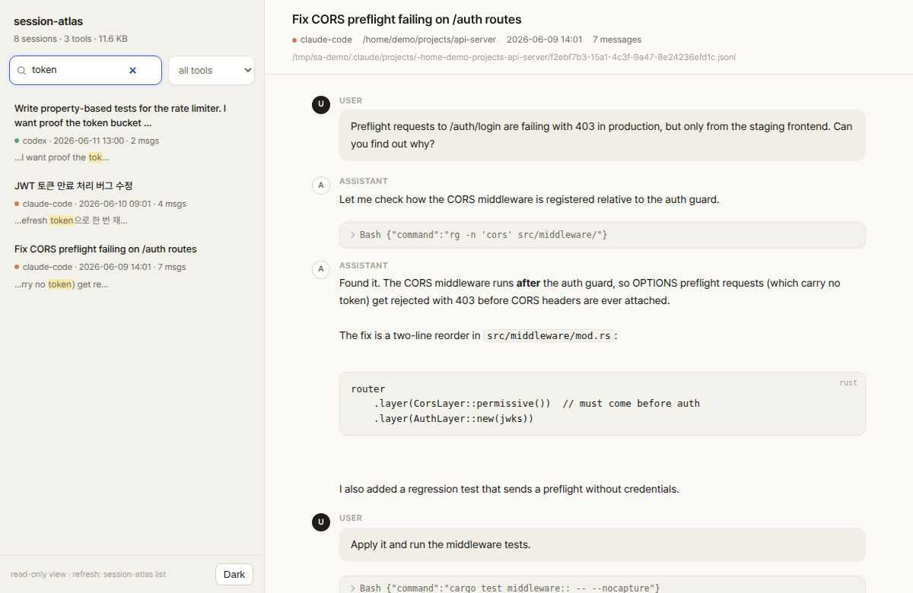
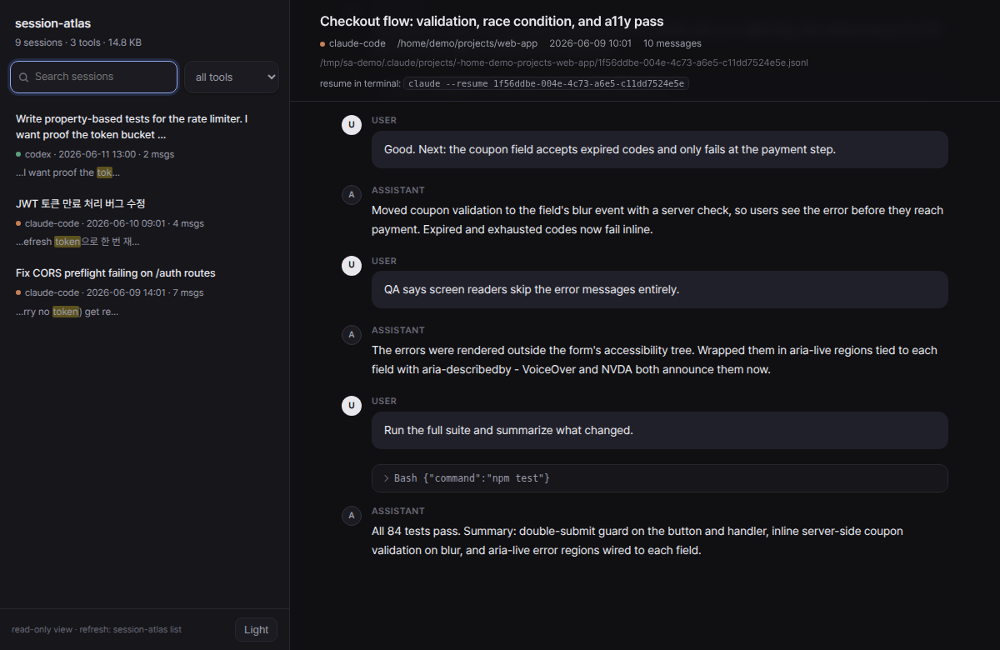

<h1 align="center">session-atlas</h1>

<p align="center">
  Every AI coding session you've ever had &mdash; found, indexed, searchable.<br>
  Claude Code &middot; Codex CLI &middot; Gemini CLI &nbsp;&middot;&nbsp; one command, 100% local
</p>

<p align="center">
  <a href="LICENSE"></a>
  
  <a href="#adding-an-adapter"></a>
</p>

<p align="center">
  
</p>

That conversation where Claude fixed your CORS bug three weeks ago? It is still on your disk &mdash; you just can't find it. Every AI coding agent writes its sessions to disk: each tool in its own format, in its own folder, on every machine you use. After a few months that is thousands of conversations full of solved problems, and no way to get back to any of them.

**session-atlas reads the traces your tools already leave and turns them into one searchable archive.** No daemon, no logging habit to build, no cloud. It indexes what is already there.

```console
$ session-atlas scan
TOOL            SESSIONS       SIZE  OLDEST       NEWEST        PATH
claude-code         1763     1.1 GB  2026-03-27   2026-06-12    ~/.claude/projects
codex               2340    45.9 GB  2025-08-21   2026-06-12    ~/.codex/sessions
gemini                50     1.2 MB  2026-04-02   2026-06-10    ~/.gemini/tmp

4153 sessions across 3 tools, 47.0 GB on disk.
```

That is one real machine. Run it on yours &mdash; the number is usually a surprise.

## Install

With Rust (stable) installed:

```console
cargo install --git https://github.com/youdie006/session-atlas
```

Prebuilt binaries are on the roadmap.

## Quick start

```console
session-atlas scan                # where are my sessions? (instant, no index)
session-atlas search "jwt retry"  # full-text search across every tool at once
session-atlas show 3f9c           # read the matching conversation
session-atlas web                 # or browse everything in a local web UI
```

The first `search` or `list` builds the index; expect a few minutes per
gigabyte of history (a one-time cost &mdash; heavy Codex users can have tens of
GB). After that, updates are incremental and take seconds.

## Commands

| Command | What it does |
|---|---|
| `scan` | Discover session stores on this machine: which tools, where, how many, how big. Pure filesystem walk, instant. |
| `list` | Recent sessions across all tools in one timeline. `--tool codex`, `--project api`, `-n 50`, `--all` (include subagent transcripts). |
| `search <query>` | Full-text search over every message of every tool. Substring matching, so partial identifiers and CJK text (Korean, Japanese, Chinese) work without any language setup. Minimum 3 characters. |
| `show <id>` | One session as a readable transcript. The id prefix from `list`/`search` output is enough. `--full` expands tool calls, `--json` emits the parsed session. |
| `resume <id>` | Reopen the session in its original tool: runs `claude --resume <uuid>` or `codex resume <uuid>` in the right project directory. `--print` to just show the command. For a subagent transcript it resumes the parent session. |
| `brief <id>` | Emit the session as a markdown briefing (head and tail of long sessions, middle omitted) &mdash; paste it into any tool to carry the context over, including across tools. `--max-chars`, `--tools`. |
| `web` | Local web viewer on `127.0.0.1:7575` &mdash; recent sessions grouped by day, live search with highlighted snippets, transcripts with rendered code blocks and collapsed tool calls, a copyable resume command per session, light and dark themes. Never leaves localhost. |

```console
$ session-atlas search "CORS preflight"
a906f587b1d1 claude-code 2026-06-09 14:01 .../projects/api-server [assistant]
  ...the preflight fails because the CORS middleware runs after the auth guard...

$ session-atlas show a906
```

The web viewer ships with a dark theme (toggle in the sidebar, follows your
system preference by default):

<p align="center">
  
</p>

## Pick up where you left off

Finding an old session is half the point; the other half is continuing it.

```console
$ session-atlas search "rate limiter"
76a614028a63 codex 2026-06-11 13:00 .../projects/api-server [assistant]
  ...the bucket invariant 0 <= tokens <= capacity holds after every step...

$ session-atlas resume 76a6           # reopens that conversation in Codex,
                                      # in the right project directory

$ session-atlas brief 76a6 | claude -p \
    "Continue this work: add the missing edge-case tests"
```

`resume` uses each tool's native mechanism (`claude --resume`, `codex resume`),
so it needs the original session file to still exist. `brief` works even
across tools: it turns the session into a compact markdown briefing you can
feed to any agent as context.

## Supported tools

| Tool | Session store | Status |
|---|---|---|
| Claude Code | `~/.claude/projects/**/*.jsonl` (incl. subagent transcripts, even nested ones) | supported |
| Codex CLI | `~/.codex/sessions/**/rollout-*.jsonl` | supported |
| Gemini CLI | `~/.gemini/tmp/*/chats/*.json` | supported |
| Cursor, OpenCode, Aider, OpenClaw, ... | | planned &mdash; see below |

## Adding an adapter

If your agent writes sessions to disk, it belongs in the atlas. An adapter is
one small Rust file implementing four methods:

```rust
pub trait Adapter {
    fn name(&self) -> &'static str;               // "my-tool"
    fn root(&self) -> Option<PathBuf>;            // where it keeps sessions
    fn discover(&self) -> Vec<PathBuf>;           // every session file
    fn parse(&self, path: &Path) -> Result<Session>; // tolerant; skip bad lines
}
```

Look at [`src/adapters/gemini.rs`](src/adapters/gemini.rs) for the smallest
example (~100 lines), register your type in [`src/adapters/mod.rs`](src/adapters/mod.rs),
and open a PR. Parsers must never panic on malformed input &mdash; session formats
drift between tool versions, so parse defensively and return what you can.

## How it works

- `scan` walks the filesystem and reports; it touches no index.
- `list`, `search`, and `show` maintain an incremental index (SQLite FTS5 with
  a trigram tokenizer) at `~/.local/share/session-atlas/index.db` (or the
  platform equivalent; override with `SESSION_ATLAS_DATA`). Only files whose
  mtime or size changed are re-parsed.
- Your original session files are never modified &mdash; the tool opens them
  read-only, and the index is a disposable cache you can delete at any time.
- Noise is filtered on purpose: repeated harness boilerplate (instruction
  dumps, environment context) and bulky tool outputs are excluded so search
  results stay signal.

## Privacy

Sessions contain your code and your conversations, so the bar is simple:

- **No network calls.** There is not a single one in the codebase &mdash; it is
  grep-friendly small if you want to verify.
- **No telemetry.** Nothing is counted, pinged, or phoned home.
- **Nothing leaves your machine.** The index lives in your local data
  directory; the web UI binds to 127.0.0.1 only.

## Roadmap

- archive mode &mdash; keep sessions in the atlas even after the tool's own
  cleanup deletes the originals (install early, lose nothing)
- `link` &mdash; connect sessions to the git commits they produced ("git blame for AI sessions")
- `sync` &mdash; merge archives from multiple machines
- `clean` &mdash; reclaim disk from huge old session stores, safely
- `stats` &mdash; usage breakdown per tool, project, and month
- prebuilt binaries
- more adapters (tell us which tool you want next in an issue)

## Contributing

Issues and PRs are welcome. The most valuable contributions right now:

1. **Adapters** for tools you use (see [Adding an adapter](#adding-an-adapter))
2. **Format fixes** when a tool update changes its session schema
3. **Bug reports** with the first few lines of a session file that fails to parse (redact freely)

## License

[MIT](LICENSE)
