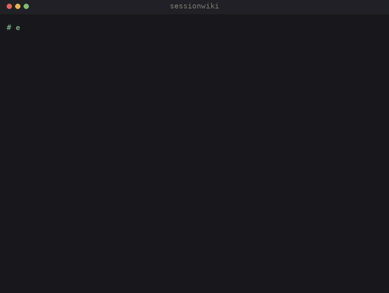
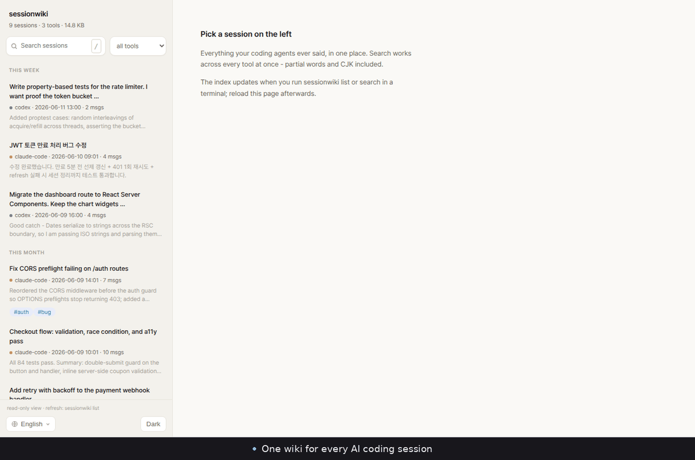
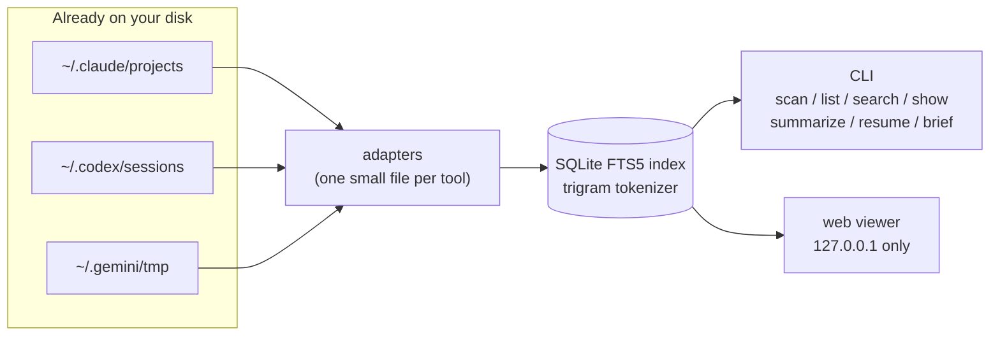

<div align="center">


<a href="https://github.com/youdie006/sessionwiki/actions/workflows/ci.yml"></a>
<a href="LICENSE"></a>
<a href="https://github.com/youdie006/sessionwiki/releases"></a>

<a href="#adding-an-adapter"></a>

&nbsp;<a href="README.ko.md"></a>

<a href="#install">Install</a> &middot;
<a href="#quick-start">Quick start</a> &middot;
<a href="#commands">Commands</a> &middot;
<a href="#pick-up-where-you-left-off">Resume &amp; brief</a> &middot;
<a href="#how-it-works">How it works</a> &middot;
<a href="#adding-an-adapter">Add your tool</a>



</div>

That conversation where Claude fixed your CORS bug three weeks ago? It is still on your disk &mdash; you just can't find it. Every AI coding agent writes its sessions to disk: each tool in its own format, in its own folder, on every machine you use. After a few months that is thousands of conversations full of solved problems, and no way to get back to any of them.

**sessionwiki reads the traces your tools already leave and turns them into one searchable, linkable archive you can actually maintain.** No daemon, no logging habit to build, no cloud. It indexes what is already there, then lets you tag it, link it, and pick up where you left off.

```console
$ sessionwiki scan
TOOL            SESSIONS       SIZE  OLDEST       NEWEST        PATH
claude-code         1763     1.1 GB  2026-03-27   2026-06-12    ~/.claude/projects
codex               2340    45.9 GB  2025-08-21   2026-06-12    ~/.codex/sessions
gemini                50     1.2 MB  2026-04-02   2026-06-10    ~/.gemini/tmp

4153 sessions across 3 tools, 47.0 GB on disk.
```

That is one real machine. Run it on yours &mdash; the number is usually a surprise.

## What you can do with it

- **Find** every session store on the machine: which tools, where, how many, how big &mdash; instant.
- **Search** every message of every tool at once. Substring matching, so partial identifiers and CJK text work with zero language setup.
- **Read** any session as a clean transcript: rendered code blocks, collapsed tool calls, an outline of long sessions.
- **Summarize** sessions into cached one-line synopses using your own LLM CLI &mdash; then never wonder "what was this one about" again.
- **Resume** a session in its original tool, in the right project directory, with one command.
- **Carry context across tools**: brief a Claude Code session into Codex, or anywhere else.
- **Curate and connect**: tag and annotate sessions, jump to related ones, and see where your agent time goes &mdash; [session engineering](#session-engineering), not just search.

And a web UI when you would rather read than grep &mdash; `sessionwiki web`:



## Install

**Prebuilt binary** (no toolchain needed). macOS / Linux:

```console
curl -sSL https://raw.githubusercontent.com/youdie006/sessionwiki/main/scripts/install.sh | sh
```

The script downloads the right archive for your platform from the
[latest release](https://github.com/youdie006/sessionwiki/releases/latest) and
installs it to `~/.local/bin`. On Windows, download the `.zip` from the
releases page.

**With Rust** (stable):

```console
cargo install --git https://github.com/youdie006/sessionwiki
```

Either way it is a single binary with no runtime dependencies.

## Quick start

```console
sessionwiki scan                # where are my sessions?
sessionwiki search "jwt retry"  # full-text search across every tool
sessionwiki show 3f9c           # read the matching conversation
sessionwiki web                 # or browse everything in a local web UI
```

The first `search` or `list` builds the index; expect a few minutes per
gigabyte of history (a one-time cost &mdash; heavy Codex users can have tens of
GB). After that, updates are incremental and take seconds.

## Commands

| Command | What it does |
|---|---|
| `scan` | Discover session stores on this machine. Pure filesystem walk, instant. |
| `list` | Recent sessions across all tools in one timeline. `--tool codex`, `--project api`, `--tag spike`, `-n 50`, `--all` (include subagent transcripts). |
| `search <query>` | Full-text search over every message of every tool. Minimum 3 characters. |
| `show <id>` | One session as a readable transcript. `--full` expands tool calls, `--json` emits the parsed session, `--outline` prints a digest: every question you asked plus how it ended. |
| `summarize [id]` | Generate 1&ndash;2 sentence synopses with **your own LLM CLI** (`claude -p` by default, `--cmd` / `SESSIONWIKI_SUMMARIZER` to change) and cache them in the index. Without an id, batches over the `--recent N` newest sessions. Summaries survive reindexing and show up in `show`, `--outline`, and the web sidebar. |
| `resume <id>` | Reopen the session in its original tool: `claude --resume` / `codex resume`, run in the right project directory. Subagent transcripts resume their parent. `--print` to just show the command. |
| `brief <id>` | Emit the session as a markdown briefing (head and tail, middle omitted) to carry context into any tool &mdash; including across tools. `--max-chars`, `--tools`. |
| `web` | Local viewer on `127.0.0.1:7575`: day-grouped sessions with synopsis previews, live search with highlighted snippets, rendered transcripts with outlines, tags, and "see also" related sessions, resume commands, light and dark themes, UI in English, Korean, Japanese, and Chinese (auto-detected). It reads the existing index (sessions created after your last `list`/`search` show up once you refresh); `web --sync` refreshes first. Never leaves localhost. |

### Session engineering

A session is a unit of context, and once you have hundreds they need curating
and managing &mdash; not just searching. These commands turn the flat archive into
a navigable, maintained one. They read the index, so they are instant.

| Command | What it does |
|---|---|
| `related <id>` | Sessions about the same thing: same project first, then anything sharing a tag. The "see also" for your work. |
| `tag <id> <tag>...` | Tag a session (`--rm` to remove). No id lists every tag in use. Filter with `list --tag`. Tags are stored in the index and survive reindexing &mdash; the original session files are never touched. |
| `note <id> "text"` | Pin a freeform note on a session; omit the text to read it back. |
| `projects` | One row per project: session count, message volume, last activity. A page per codebase. |
| `stats` | Totals plus a breakdown by tool and by month. Where your agent time actually goes. |

## Pick up where you left off

Finding an old session is half the point; the other half is continuing it.

```console
$ sessionwiki search "rate limiter"
76a614028a63 codex 2026-06-11 13:00 .../projects/api-server [assistant]
  ...the bucket invariant 0 <= tokens <= capacity holds after every step...

$ sessionwiki resume 76a6           # reopens that conversation in Codex

$ sessionwiki brief 76a6 | claude -p \
    "Continue this work: add the missing edge-case tests"

$ sessionwiki summarize --recent 20  # synopses for your latest sessions
```

`resume` uses each tool's native mechanism, so it needs the original session
file to still exist. `brief` works even across tools. `summarize` runs your
LLM, on your machine, at your command &mdash; sessionwiki itself never makes a
network call.

## How it works



- `scan` walks the filesystem and reports; it touches no index.
- Everything else maintains an incremental index at
  `~/.local/share/sessionwiki/index.db` (platform equivalent; override with
  `SESSIONWIKI_DATA`). Only files whose mtime or size changed are re-parsed.
- Original session files are never modified &mdash; the index is a disposable
  cache. Cached summaries survive schema upgrades on purpose: rebuilding an
  index is cheap, re-running an LLM over your history is not.
- Noise is filtered deliberately: repeated harness boilerplate and bulky tool
  outputs stay out of the index so search results stay signal.

<details>
<summary><b>FAQ: why not just grep the session folders?</b></summary>
<br>

You can, but the files are JSONL event streams with escaped text in three
different schemas. grep gives you raw matching lines out of context; the
trigram index gives ranked results with snippets in milliseconds, joined to
session metadata, including nested subagent transcripts, across all tools at
once &mdash; and the id it returns plugs straight into `show`, `resume`, and `brief`.
</details>

<details>
<summary><b>FAQ: does anything ever leave my machine?</b></summary>
<br>

No. There is not a single network call in the codebase &mdash; it is small enough
to verify with one grep. No telemetry, no accounts. The web UI binds to
127.0.0.1 only. `summarize` is the one feature that touches an LLM, and it
does so by running a CLI you chose, locally, only when you invoke it.
</details>

<details>
<summary><b>FAQ: how big is the index?</b></summary>
<br>

Expect a low double-digit percentage of your stores' size; tens of GB of
history produce a few GB of index. It is a cache &mdash; delete it whenever you
want and the next run rebuilds it. Cached summaries are kept separately so
they survive.
</details>

<details>
<summary><b>FAQ: what about sessions my tool already deleted?</b></summary>
<br>

Gone is gone &mdash; sessionwiki reads what is on disk, and some tools clean up
old sessions on a schedule (Claude Code's retention setting, for example).
That is exactly what the planned archive mode fixes: keep a copy inside the
atlas so the tool's cleanup stops being your memory's expiry date. Install
early, lose nothing.
</details>

## Privacy

Sessions contain your code and your conversations, so the bar is simple:
no network calls, no telemetry, index stored locally, originals opened
read-only. See the FAQ above.

## Supported tools

| Tool | Session store | Status |
|---|---|---|
| Claude Code | `~/.claude/projects/**/*.jsonl` (incl. nested subagent transcripts) | supported |
| Codex CLI | `~/.codex/sessions/**/rollout-*.jsonl` | supported |
| Gemini CLI | `~/.gemini/tmp/*/chats/*.json` | supported |
| Cursor, OpenCode, Aider, OpenClaw, ... | | planned &mdash; PRs welcome |

### How this differs from a single-tool history viewer

There are good tools that browse one agent's history &mdash; a Claude Code
session viewer, a Codex log reader. sessionwiki is deliberately the layer above
them: one index across **every** tool, so you search without first remembering
which agent you used; a CLI **and** a local web UI rather than one or the other;
cross-platform (Linux, macOS, Windows) rather than a single-OS app; and
`resume` / `brief` so finding a session is a step toward continuing the work,
not just reading it. If you only ever use one tool on one OS, a dedicated
viewer may be all you need. If your history is scattered across tools and
machines, that scatter is the problem this solves.

## Adding an adapter

If your agent writes sessions to disk, it belongs in the atlas. An adapter is
one small Rust file implementing four methods:

```rust
pub trait Adapter {
    fn name(&self) -> &'static str;               // "my-tool"
    fn root(&self) -> Option<PathBuf>;            // where it keeps sessions
    fn discover(&self) -> Vec<PathBuf>;           // every session file
    fn parse(&self, path: &Path) -> Result<Session>; // tolerant; skip bad lines
}
```

Look at [`src/adapters/gemini.rs`](src/adapters/gemini.rs) for the smallest
example (~100 lines), register your type in [`src/adapters/mod.rs`](src/adapters/mod.rs),
and open a PR. Parsers must never panic on malformed input &mdash; session formats
drift between tool versions, so parse defensively and return what you can.

## Roadmap

- archive mode &mdash; keep sessions in the atlas even after the tool's own
  cleanup deletes the originals (install early, lose nothing)
- `link` &mdash; connect sessions to the git commits they produced ("git blame for AI sessions")
- `sync` &mdash; merge archives from multiple machines
- `clean` &mdash; reclaim disk from huge old session stores, safely
- prebuilt binaries
- more adapters (tell us which tool you want next in an issue)

## Contributing

Issues and PRs are welcome. The most valuable contributions right now:

1. **Adapters** for tools you use (see [Adding an adapter](#adding-an-adapter))
2. **Format fixes** when a tool update changes its session schema
3. **Bug reports** with the first few lines of a session file that fails to parse (redact freely)

## License

[MIT](LICENSE). Free for any use, including commercial &mdash; just keep the license notice.

<div align="center">
<br>

<a href="https://github.com/youdie006/sessionwiki/issues/new">Report a bug</a> &middot;
<a href="https://github.com/youdie006/sessionwiki/issues/new">Request an adapter</a> &middot;
<a href="#roadmap">Roadmap</a>

</div>
