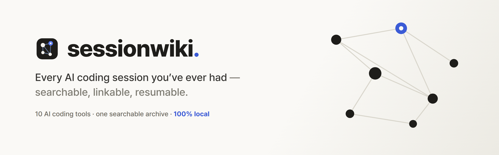
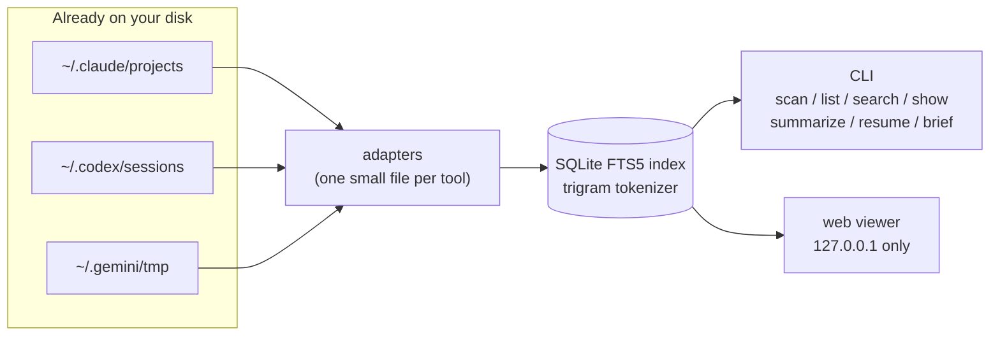

<div align="center">

<picture>
  <source media="(prefers-color-scheme: dark)" srcset="docs/banner-dark.png">
  
</picture>

<a href="https://github.com/youdie006/sessionwiki/actions/workflows/ci.yml"></a>
<a href="LICENSE"></a>
<a href="https://github.com/youdie006/sessionwiki/releases"></a>

<b>English</b> &middot; <a href="README.ko.md">한국어</a>

<a href="#install"></a>
<a href="#quick-start"></a>
<a href="#commands"></a>
<a href="#trace-code-back-to-its-session"></a>
<a href="#nothing-gets-lost-archive-mode"></a>
<a href="#pick-up-where-you-left-off"></a>
<a href="#adding-an-adapter"></a>


</div>

That conversation where Claude fixed your CORS bug three weeks ago? It is still on your disk &mdash; you just can't find it. Every AI coding agent writes its sessions to disk: each tool in its own format, in its own folder, on every machine you use. After a few months that is thousands of conversations full of solved problems, and no way to get back to any of them.

**sessionwiki reads the traces your tools already leave and turns them into one searchable, linkable archive you can actually maintain.** No daemon, no logging habit to build, no cloud. It indexes what is already there, then lets you tag it, link it, and pick up where you left off.

```console
$ sessionwiki scan
TOOL            SESSIONS       SIZE  OLDEST       NEWEST        PATH
claude-code         1763     1.1 GB  2026-03-27   2026-06-12    ~/.claude/projects
codex               2340    45.9 GB  2025-08-21   2026-06-12    ~/.codex/sessions
gemini                50     1.2 MB  2026-04-02   2026-06-10    ~/.gemini/tmp

4153 sessions across 3 tools, 47.0 GB on disk.
```

That is one real machine. Run it on yours &mdash; the number is usually a surprise.

## What you can do with it

- **Search** every message of every tool at once &mdash; substring + CJK, zero setup.
- **Read & resume** &mdash; any session as a clean transcript; reopen it in its original tool, or `brief` it into another (even a different tool).
- **Trace** a file back to the AI conversations that wrote it, across every tool &mdash; the link between your sessions and your code. See [provenance](#trace-code-back-to-its-session).
- **Keep & reclaim** &mdash; sessions are [archived](#nothing-gets-lost-archive-mode) when a tool deletes them, so search never goes dark; delete the bulky originals to reclaim disk and still search them.
- **Curate** &mdash; tag, note, and jump to [related](#session-engineering) sessions, and see where your agent time goes.

And a web UI when you would rather read than grep &mdash; `sessionwiki web`:


## Install

**Prebuilt binary** (no toolchain needed). macOS / Linux / WSL:

```console
curl -sSL https://raw.githubusercontent.com/youdie006/sessionwiki/main/scripts/install.sh | sh
```

**Windows** (native PowerShell):

```powershell
irm https://raw.githubusercontent.com/youdie006/sessionwiki/main/scripts/install.ps1 | iex
```

Each script downloads the right archive for your platform from the
[latest release](https://github.com/youdie006/sessionwiki/releases/latest),
verifies its checksum, and installs the binary (`~/.local/bin`, or
`%LOCALAPPDATA%\Programs\sessionwiki` on Windows). **WSL is Linux** &mdash; use
the shell one-liner above; it installs the Linux binary and reads the session
stores in your WSL home.

**With Rust** (stable):

```console
cargo install sessionwiki
```

Either way it is a single binary with no runtime dependencies.

### Claude Code plugin (automatic session recall)

Make Claude Code recall your past sessions automatically. Install the
`sessionwiki` CLI first (above), then add the plugin from this repo:

```console
/plugin marketplace add youdie006/sessionwiki
/plugin install sessionwiki@sessionwiki-marketplace
```

Now Claude pulls in prior work when you start a task, and `/sessionwiki:recall
<topic>` searches your history on demand. The plugin shells out to the local
`sessionwiki` binary &mdash; fully offline. If the binary isn't on `PATH`, the
plugin degrades gracefully and Claude just works without recall.

## Quick start

```console
sessionwiki scan                # where are my sessions?
sessionwiki search "jwt retry"  # full-text search across every tool
sessionwiki show 3f9c           # read the matching conversation
sessionwiki web                 # or browse everything in a local web UI
```

The first `search` or `list` builds the index; expect a few minutes per
gigabyte of history (a one-time cost &mdash; heavy Codex users can have tens of
GB). After that, updates are incremental and take seconds.

## Commands

| Command | What it does |
|---|---|
| `scan` | Discover session stores on this machine. Pure filesystem walk, instant. |
| `list` | Recent sessions across all tools in one timeline. `--tool codex`, `--project api`, `--tag spike`, `-n 50`, `--all` (include subagent transcripts). |
| `search <query>` | Full-text search over every message of every tool. Minimum 3 characters. |
| `recall <query>` | One shot: search, list the candidate matches, and brief the top one &mdash; the search &rarr; pick id &rarr; brief loop in a single command. `--tool`, `--project`, `-n`, `--max-chars`, `--json` (for agents). The fastest way back into a past session. |
| `show <id>` | One session as a readable transcript. `--full` expands tool calls, `--json` emits the parsed session, `--outline` prints a digest: every question you asked plus how it ended. |
| `summarize [id]` | Generate 1&ndash;2 sentence synopses with **your own LLM CLI** (`claude -p` by default, `--cmd` / `SESSIONWIKI_SUMMARIZER` to change) and cache them in the index. Without an id, batches over the `--recent N` newest sessions. Summaries survive reindexing and show up in `show`, `--outline`, and the web sidebar. |
| `resume <id>` | Reopen the session in its original tool: `claude --resume` / `codex resume`, run in the right project directory. Subagent transcripts resume their parent. `--print` to just show the command. |
| `migrate <id> <dir>` | Make a session resumable from a different project directory. Claude Code scopes resume to the project folder, so the transcript is copied into `<dir>`'s store; Codex resumes by id from anywhere (nothing to copy); Gemini copies the chat into the target project. The original is never touched. |
| `brief <id>` | Emit the session as a markdown briefing (head and tail, middle omitted) to carry context into any tool &mdash; including across tools. `--max-chars`, `--tools`. |
| `web` | Local viewer on `127.0.0.1:7575`: day-grouped sessions with synopsis previews, live search with highlighted snippets, rendered transcripts with outlines, tags, and "see also" related sessions, resume commands, light and dark themes, UI in English, Korean, Japanese, and Chinese (auto-detected). It reads the existing index (sessions created after your last `list`/`search` show up once you refresh); `web --sync` refreshes first. Never leaves localhost. |
| `sync [--tool]` | Build or refresh the index on demand. Pair with `--no-sync` (below) so queries skip the store walk. Handy from a cron to keep the index warm. |

Every query command (`search`, `list`, `recall`, `show`, `brief`, `resume`, `trace`) takes `--no-sync` to query the already-built index without re-walking the stores &mdash; the fast path when something else (e.g. a cron running `sessionwiki sync`) keeps the index current.

### Session engineering

A session is a unit of context, and once you have hundreds they need curating
and managing &mdash; not just searching. These commands turn the flat archive into
a navigable, maintained one. They read the index, so they are instant.

| Command | What it does |
|---|---|
| `related <id>` | Sessions about the same thing: same project first, then sessions that edited the same files, then anything sharing a tag. The "see also" for your work. |
| `files <id>` | The files a session edited or created &mdash; its side of the provenance link. |
| `trace <path>` | The AI sessions that touched a file, newest first. Matches a relative path against the absolute one on disk, so `trace src/auth.rs` just works. See [below](#trace-code-back-to-its-session). |
| `blame <path>` | git blame for the AI era: attributes each line to the AI session most likely behind the commit that last changed it, by joining `git blame` with the index. `-L 40,80` for a range. Best-effort, not proof of authorship &mdash; `ambiguous`/`unattributed` are normal, and it falls back to file-level `trace`. |
| `tag <id> <tag>...` | Tag a session (`--rm` to remove). No id lists every tag in use. Filter with `list --tag`. Tags are stored in the index and survive reindexing &mdash; the original session files are never touched. |
| `note <id> "text"` | Pin a freeform note on a session; omit the text to read it back. |
| `forget <id>` | Permanently drop a session from the index and archive. The escape hatch for [archive mode](#nothing-gets-lost-archive-mode) when you want a kept session gone. |
| `projects` | One row per project: session count, message volume, last activity. A page per codebase. |
| `stats` | Totals plus a breakdown by tool, by month, files linked to sessions, and how many sessions were kept after the tools deleted them. |
| `digest [--since 7d]` | A markdown rollup of recent sessions grouped by project &mdash; what you worked on, the files each touched, and any cached synopsis. `--since 2w`/`24h`/`90m`, `--project`, `--tool`, `--json`. The standup / PR-body / "what did I ship this week" view, assembled from the index. |

### Trace code back to its session

AI writes most of the code now, so the question is no longer "who wrote this
line" but "which conversation produced it, and why." sessionwiki reads the file
edits out of each session's tool calls &mdash; Claude's `Edit`/`Write`, Codex's
`apply_patch` &mdash; and links every session to the files it changed.

```console
$ sessionwiki trace src/middleware/mod.rs
2 session(s) touched "src/middleware/mod.rs", newest first:
35a59790  claude-code  2026-06-09  Fix CORS preflight failing on /auth routes
4fd0ce37  claude-code  2026-06-08  Add retry with backoff to the payment webhook handler
```

It works retroactively, with no hooks or setup, over every session already on
disk &mdash; nothing to install before the fact. The honest scope: this points
you at the conversations that *touched* a file, not at line-level authorship; a
later edit may have replaced the code, so `trace` is a way back to the relevant
discussion, not a claim that a given line came from one session. In the web UI,
the files a session touched are chips in its header &mdash; click one to see
every other session that touched it.

### Nothing gets lost (archive mode)

Claude Code and Codex prune old sessions over time. The first time `trace`
comes up empty for a file you *know* an agent wrote &mdash; because the session
behind it was deleted &mdash; the whole link is worthless. So once sessionwiki
has indexed a session, it keeps it: when a tool deletes the original, the
session is **archived**, not dropped, and `search`, `trace`, and `brief` keep
working for it.

```console
$ sessionwiki list          # after Claude pruned an old session
archived 1 session(s) the tool removed (1 kept that your tools have deleted)
...
a1b2c3d4  claude-code  3w ago  12  …/api-server  Fix CORS preflight…  [archived]
```

It is automatic and reversible: `forget <id>` drops an archived session for good,
and a session that reappears on disk un-archives itself. The original tool can no
longer reopen it, but you can still read, `brief`, and `trace` it. This is the
part a generation-time hook can't do &mdash; it works for the sessions that
already exist, and the ones the tool deleted while you weren't looking.

**It also reclaims disk.** The index keeps only a distilled copy of each session
(the conversation and its file links, minus bulky tool output), so it is far
smaller than the raw stores &mdash; roughly 7&times; on the machine above (47 GB
&rarr; ~7 GB). Delete the old raw sessions to free the space and `search`,
`trace`, `brief`, and reading still work from the index. The tradeoff: an
archived session is the distilled transcript, not the byte-exact original &mdash;
which is exactly the part you want when you are hunting for the conversation that
solved something.

## Pick up where you left off

Finding an old session is half the point; the other half is continuing it.

```console
$ sessionwiki search "rate limiter"
76a614028a63 codex 2026-06-11 13:00 .../projects/api-server [assistant]
  ...the bucket invariant 0 <= tokens <= capacity holds after every step...

$ sessionwiki resume 76a6           # reopens that conversation in Codex

$ sessionwiki brief 76a6 | claude -p \
    "Continue this work: add the missing edge-case tests"

$ sessionwiki summarize --recent 20  # synopses for your latest sessions
```

`resume` uses each tool's native mechanism, so it needs the original session
file to still exist. `brief` works even across tools. `summarize` runs your
LLM, on your machine, at your command &mdash; sessionwiki itself never makes a
network call.

## How it works



- `scan` walks the filesystem and reports; it touches no index.
- Everything else maintains an incremental index at
  `~/.local/share/sessionwiki/index.db` (platform equivalent; override with
  `SESSIONWIKI_DATA`). Only files whose mtime or size changed are re-parsed.
- Original session files are never modified &mdash; the index is a disposable
  cache. Cached summaries survive schema upgrades on purpose: rebuilding an
  index is cheap, re-running an LLM over your history is not.
- Noise is filtered deliberately: repeated harness boilerplate and bulky tool
  outputs stay out of the index so search results stay signal.

<details>
<summary><b>FAQ: why not just grep the session folders?</b></summary>
<br>

You can, but the files are JSONL event streams with escaped text in three
different schemas. grep gives you raw matching lines out of context; the
trigram index gives ranked results with snippets in milliseconds, joined to
session metadata, including nested subagent transcripts, across all tools at
once &mdash; and the id it returns plugs straight into `show`, `resume`, and `brief`.
</details>

## Privacy

Sessions contain your code and your conversations, so the bar is simple: **not a
single network call in the codebase** (small enough to verify with one grep), no
telemetry, no accounts. The index is local; originals are opened read-only. The
one feature that touches an LLM is `summarize`, and it does so by running a CLI
*you* chose, locally, only when you invoke it.

## Supported tools

| Tool | Session store | Status |
|---|---|---|
| Claude Code | `~/.claude/projects/**/*.jsonl` (incl. nested subagent transcripts) | supported |
| Codex CLI | `~/.codex/sessions/**/rollout-*.jsonl` | supported |
| Gemini CLI | `~/.gemini/tmp/*/chats/*.json` | supported |
| OpenCode | `~/.local/share/opencode/opencode.db` (SQLite; also the legacy `storage/**` JSON) | supported |
| Cline, Roo Code, Kilo Code | VS Code `globalStorage/<ext>/tasks/<id>/` (one parser, three tools) | supported |
| gajae-code (& Pi) | `~/.gjc/agent/sessions/**/*.jsonl` | supported |
| Continue | `~/.continue/sessions/*.json` | supported |
| gptme | `~/.local/share/gptme/logs/<session>/conversation.jsonl` | supported |
| Cursor, Aider, Zed, ... | | planned &mdash; PRs welcome |

**Using a wrapper like oh-my-claudecode or oh-my-openagent?** Those run on top of
Claude Code / Codex / OpenCode, so their conversations already live in those
tools' stores and get indexed automatically. When the harness's `.omc` / `.omo`
directory is present in a project, sessionwiki tags the session so `list --tag
oh-my-claudecode` works &mdash; a filesystem signal, so a session that merely
*discusses* a harness is never mislabeled.

### How it compares

Browsing AI session history is an active space. Each of these is good at what it
does; sessionwiki's bet is the one thing none of them do &mdash; link the
conversation to the code it produced.

| | Great at | What sessionwiki adds |
|---|---|---|
| [Claudia](https://github.com/getAsterisk/claudia) | A polished Claude Code GUI | Cross-tool, CLI *and* web, and `trace` links code back to its conversation |
| [SpecStory](https://specstory.com) | Capturing chat history as you work | Works retroactively over the sessions you already have &mdash; no capture step |
| [claude-code-log](https://github.com/daaain/claude-code-log) | Rendering one tool's transcripts to HTML | Every tool at once, full-text search, and provenance |
| [cass](https://github.com/Dicklesworthstone/coding_agent_session_search) | Fast cross-tool + cross-machine search | File&rarr;conversation provenance, archived deleted sessions, curation, web UI |

**`trace <file>`** goes from a file to the AI conversations that edited it
&mdash; retroactively, no hooks, across every tool, [even for sessions your tool
has since deleted](#nothing-gets-lost-archive-mode). A generation-time hook can't
do that for the sessions you already have; a single-tool viewer can't do it
across tools.

Honest tradeoff: a dedicated single-tool viewer will have more tool-specific
polish than sessionwiki's adapter for that one tool. The bet is the cross-tool
spine plus code provenance, over [ten tools today](#supported-tools) and
growing &mdash; adapters are the #1 thing [PRs](#adding-an-adapter) help with.

## Adding an adapter

If your agent writes sessions to disk, it belongs here. An adapter is
one small Rust file implementing four methods:

```rust
pub trait Adapter {
    fn name(&self) -> &'static str;               // "my-tool"
    fn root(&self) -> Option<PathBuf>;            // where it keeps sessions
    fn discover(&self) -> Vec<PathBuf>;           // every session file
    fn parse(&self, path: &Path) -> Result<Session>; // tolerant; skip bad lines
}
```

Look at [`src/adapters/gemini.rs`](src/adapters/gemini.rs) for the smallest
example (~100 lines), register your type in [`src/adapters/mod.rs`](src/adapters/mod.rs),
and open a PR. Parsers must never panic on malformed input &mdash; session formats
drift between tool versions, so parse defensively and return what you can.

## Roadmap

- more adapters &mdash; Cursor, Aider, Zed, ... the #1 thing PRs
  help with (see [adding an adapter](#adding-an-adapter))
- `merge` &mdash; combine indexes from multiple machines into one
- `clean` &mdash; reclaim disk from huge old session stores, safely
- prebuilt binaries for every platform

Shipped recently: [provenance](#trace-code-back-to-its-session) (`trace` /
`files`) and [archive mode](#nothing-gets-lost-archive-mode).

## Contributing

Issues and PRs are welcome. The most valuable contributions right now:

1. **Adapters** for tools you use (see [Adding an adapter](#adding-an-adapter))
2. **Format fixes** when a tool update changes its session schema
3. **Bug reports** with the first few lines of a session file that fails to parse (redact freely)

## License

[MIT](LICENSE). Free for any use, including commercial &mdash; just keep the license notice.

<div align="center">
<br>

<a href="https://github.com/youdie006/sessionwiki/issues/new">Report a bug</a> &middot;
<a href="https://github.com/youdie006/sessionwiki/issues/new">Request an adapter</a> &middot;
<a href="#roadmap">Roadmap</a>

</div>
