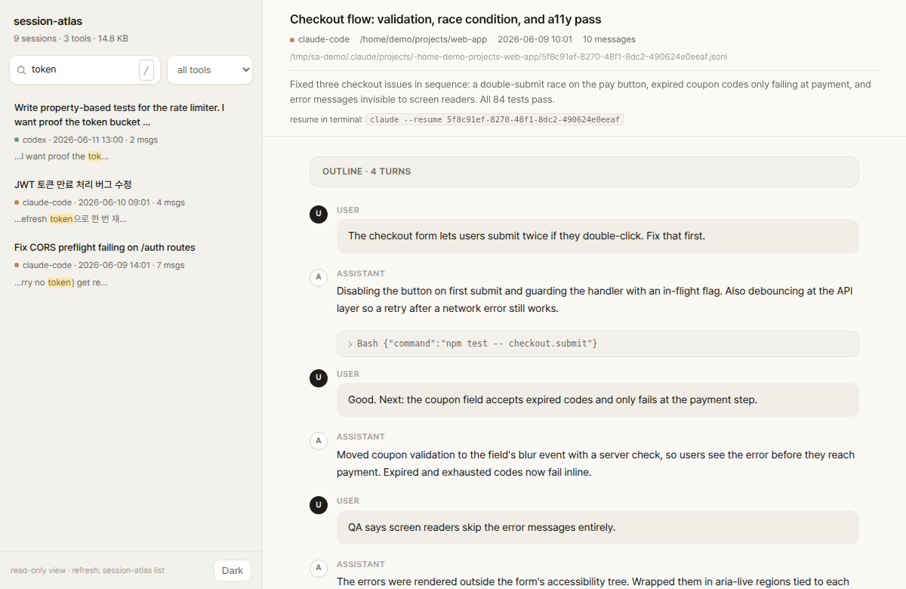
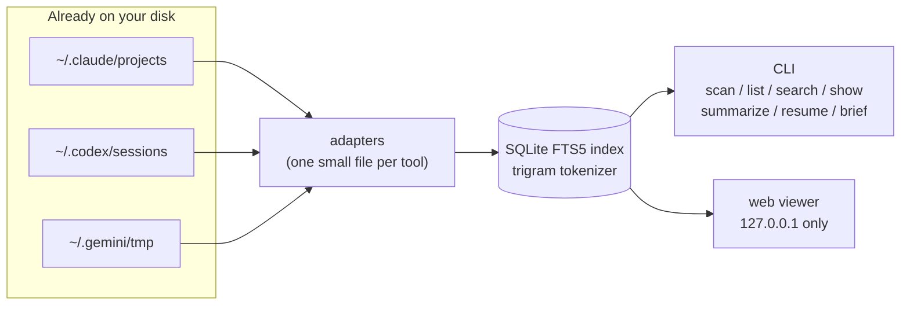

<div align="center">

<picture>
  <source media="(prefers-color-scheme: dark)" srcset="docs/logo-dark.svg">
  
</picture>

# session-atlas

Every AI coding session you've ever had &mdash; found, indexed, searchable, resumable.<br>
Claude Code &middot; Codex CLI &middot; Gemini CLI &nbsp;&middot;&nbsp; one command, 100% local

<a href="LICENSE"></a>
<a href="https://github.com/youdie006/session-atlas/tags"></a>


<a href="#adding-an-adapter"></a>

<a href="#install">Install</a> &middot;
<a href="#quick-start">Quick start</a> &middot;
<a href="#commands">Commands</a> &middot;
<a href="#pick-up-where-you-left-off">Resume &amp; brief</a> &middot;
<a href="#how-it-works">How it works</a> &middot;
<a href="#adding-an-adapter">Add your tool</a>

<picture>
  <source media="(prefers-color-scheme: dark)" srcset="docs/hero-dark.png">
  
</picture>

</div>

That conversation where Claude fixed your CORS bug three weeks ago? It is still on your disk &mdash; you just can't find it. Every AI coding agent writes its sessions to disk: each tool in its own format, in its own folder, on every machine you use. After a few months that is thousands of conversations full of solved problems, and no way to get back to any of them.

**session-atlas reads the traces your tools already leave and turns them into one searchable, resumable archive.** No daemon, no logging habit to build, no cloud. It indexes what is already there.

```console
$ session-atlas scan
TOOL            SESSIONS       SIZE  OLDEST       NEWEST        PATH
claude-code         1763     1.1 GB  2026-03-27   2026-06-12    ~/.claude/projects
codex               2340    45.9 GB  2025-08-21   2026-06-12    ~/.codex/sessions
gemini                50     1.2 MB  2026-04-02   2026-06-10    ~/.gemini/tmp

4153 sessions across 3 tools, 47.0 GB on disk.
```

That is one real machine. Run it on yours &mdash; the number is usually a surprise.

## What you can do with it

- **Find** every session store on the machine: which tools, where, how many, how big &mdash; instant.
- **Search** every message of every tool at once. Substring matching, so partial identifiers and CJK text work with zero language setup.
- **Read** any session as a clean transcript: rendered code blocks, collapsed tool calls, an outline of long sessions.
- **Summarize** sessions into cached one-line synopses using your own LLM CLI &mdash; then never wonder "what was this one about" again.
- **Resume** a session in its original tool, in the right project directory, with one command.
- **Carry context across tools**: brief a Claude Code session into Codex, or anywhere else.

## Install

With Rust (stable) installed:

```console
cargo install --git https://github.com/youdie006/session-atlas
```

Prebuilt binaries are on the roadmap.

## Quick start

```console
session-atlas scan                # where are my sessions?
session-atlas search "jwt retry"  # full-text search across every tool
session-atlas show 3f9c           # read the matching conversation
session-atlas web                 # or browse everything in a local web UI
```

The first `search` or `list` builds the index; expect a few minutes per
gigabyte of history (a one-time cost &mdash; heavy Codex users can have tens of
GB). After that, updates are incremental and take seconds.

## Commands

| Command | What it does |
|---|---|
| `scan` | Discover session stores on this machine. Pure filesystem walk, instant. |
| `list` | Recent sessions across all tools in one timeline. `--tool codex`, `--project api`, `-n 50`, `--all` (include subagent transcripts). |
| `search <query>` | Full-text search over every message of every tool. Minimum 3 characters. |
| `show <id>` | One session as a readable transcript. `--full` expands tool calls, `--json` emits the parsed session, `--outline` prints a digest: every question you asked plus how it ended. |
| `summarize [id]` | Generate 1&ndash;2 sentence synopses with **your own LLM CLI** (`claude -p` by default, `--cmd` / `SESSION_ATLAS_SUMMARIZER` to change) and cache them in the index. Without an id, batches over the `--recent N` newest sessions. Summaries survive reindexing and show up in `show`, `--outline`, and the web sidebar. |
| `resume <id>` | Reopen the session in its original tool: `claude --resume` / `codex resume`, run in the right project directory. Subagent transcripts resume their parent. `--print` to just show the command. |
| `brief <id>` | Emit the session as a markdown briefing (head and tail, middle omitted) to carry context into any tool &mdash; including across tools. `--max-chars`, `--tools`. |
| `web` | Local viewer on `127.0.0.1:7575`: day-grouped sessions with synopsis previews, live search with highlighted snippets, rendered transcripts with outlines and resume commands, light and dark themes. Never leaves localhost. |

## Pick up where you left off

Finding an old session is half the point; the other half is continuing it.

```console
$ session-atlas search "rate limiter"
76a614028a63 codex 2026-06-11 13:00 .../projects/api-server [assistant]
  ...the bucket invariant 0 <= tokens <= capacity holds after every step...

$ session-atlas resume 76a6           # reopens that conversation in Codex

$ session-atlas brief 76a6 | claude -p \
    "Continue this work: add the missing edge-case tests"

$ session-atlas summarize --recent 20  # synopses for your latest sessions
```

`resume` uses each tool's native mechanism, so it needs the original session
file to still exist. `brief` works even across tools. `summarize` runs your
LLM, on your machine, at your command &mdash; session-atlas itself never makes a
network call.

## How it works



- `scan` walks the filesystem and reports; it touches no index.
- Everything else maintains an incremental index at
  `~/.local/share/session-atlas/index.db` (platform equivalent; override with
  `SESSION_ATLAS_DATA`). Only files whose mtime or size changed are re-parsed.
- Original session files are never modified &mdash; the index is a disposable
  cache. Cached summaries survive schema upgrades on purpose: rebuilding an
  index is cheap, re-running an LLM over your history is not.
- Noise is filtered deliberately: repeated harness boilerplate and bulky tool
  outputs stay out of the index so search results stay signal.

<details>
<summary><b>FAQ: why not just grep the session folders?</b></summary>
<br>

You can, but the files are JSONL event streams with escaped text in three
different schemas. grep gives you raw matching lines out of context; the
trigram index gives ranked results with snippets in milliseconds, joined to
session metadata, including nested subagent transcripts, across all tools at
once &mdash; and the id it returns plugs straight into `show`, `resume`, and `brief`.
</details>

<details>
<summary><b>FAQ: does anything ever leave my machine?</b></summary>
<br>

No. There is not a single network call in the codebase &mdash; it is small enough
to verify with one grep. No telemetry, no accounts. The web UI binds to
127.0.0.1 only. `summarize` is the one feature that touches an LLM, and it
does so by running a CLI you chose, locally, only when you invoke it.
</details>

<details>
<summary><b>FAQ: how big is the index?</b></summary>
<br>

Expect a low double-digit percentage of your stores' size; tens of GB of
history produce a few GB of index. It is a cache &mdash; delete it whenever you
want and the next run rebuilds it. Cached summaries are kept separately so
they survive.
</details>

<details>
<summary><b>FAQ: what about sessions my tool already deleted?</b></summary>
<br>

Gone is gone &mdash; session-atlas reads what is on disk, and some tools clean up
old sessions on a schedule (Claude Code's retention setting, for example).
That is exactly what the planned archive mode fixes: keep a copy inside the
atlas so the tool's cleanup stops being your memory's expiry date. Install
early, lose nothing.
</details>

## Privacy

Sessions contain your code and your conversations, so the bar is simple:
no network calls, no telemetry, index stored locally, originals opened
read-only. See the FAQ above.

## Supported tools

| Tool | Session store | Status |
|---|---|---|
| Claude Code | `~/.claude/projects/**/*.jsonl` (incl. nested subagent transcripts) | supported |
| Codex CLI | `~/.codex/sessions/**/rollout-*.jsonl` | supported |
| Gemini CLI | `~/.gemini/tmp/*/chats/*.json` | supported |
| Cursor, OpenCode, Aider, OpenClaw, ... | | planned &mdash; PRs welcome |

## Adding an adapter

If your agent writes sessions to disk, it belongs in the atlas. An adapter is
one small Rust file implementing four methods:

```rust
pub trait Adapter {
    fn name(&self) -> &'static str;               // "my-tool"
    fn root(&self) -> Option<PathBuf>;            // where it keeps sessions
    fn discover(&self) -> Vec<PathBuf>;           // every session file
    fn parse(&self, path: &Path) -> Result<Session>; // tolerant; skip bad lines
}
```

Look at [`src/adapters/gemini.rs`](src/adapters/gemini.rs) for the smallest
example (~100 lines), register your type in [`src/adapters/mod.rs`](src/adapters/mod.rs),
and open a PR. Parsers must never panic on malformed input &mdash; session formats
drift between tool versions, so parse defensively and return what you can.

## Roadmap

- archive mode &mdash; keep sessions in the atlas even after the tool's own
  cleanup deletes the originals (install early, lose nothing)
- `link` &mdash; connect sessions to the git commits they produced ("git blame for AI sessions")
- `sync` &mdash; merge archives from multiple machines
- `clean` &mdash; reclaim disk from huge old session stores, safely
- `stats` &mdash; usage breakdown per tool, project, and month
- prebuilt binaries
- more adapters (tell us which tool you want next in an issue)

## Contributing

Issues and PRs are welcome. The most valuable contributions right now:

1. **Adapters** for tools you use (see [Adding an adapter](#adding-an-adapter))
2. **Format fixes** when a tool update changes its session schema
3. **Bug reports** with the first few lines of a session file that fails to parse (redact freely)

## License

[MIT](LICENSE)

<div align="center">
<br>

<a href="https://github.com/youdie006/session-atlas/issues/new">Report a bug</a> &middot;
<a href="https://github.com/youdie006/session-atlas/issues/new">Request an adapter</a> &middot;
<a href="#roadmap">Roadmap</a>

</div>
